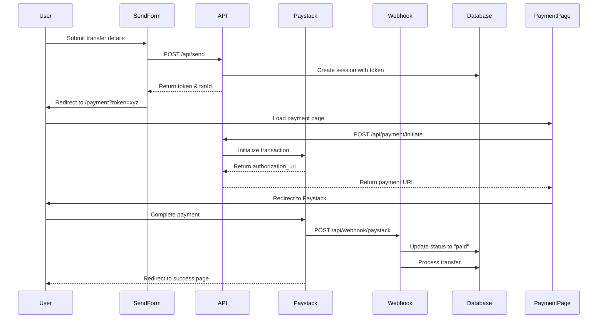

# Paystack Payment Integration - Technical Workflow

## Overview

This document describes the technical workflow for integrating Paystack payment gateway in the AnonSend frontend application. Paystack is used to collect payments from users before initiating anonymous transfers to recipients.

## Architecture Components

### Frontend Components
- **Send Form** (`/app/send/page.tsx`) - Transaction initiation
- **Payment Page** (`/app/payment/page.tsx`) - Payment processing interface
- **Success Page** (`/app/payment/success/page.tsx`) - Post-payment confirmation

### Backend API Routes
- **Transaction Initialization** (`/app/api/send/route.ts`) - Creates session token
- **Payment Initiation** (`/app/api/payment/initiate/route.ts`) - Initializes Paystack transaction
- **Webhook Handler** (`/app/api/webhook/paystack/route.ts`) - Processes payment confirmations

### Business Logic
- **sendEngine.ts** - Transaction session management
- **utils.ts** - Signature generation and token handling

## Payment Flow Diagram



## Implementation Steps

### 1. Environment Configuration

```bash
# .env.local
NEXT_PUBLIC_PAYSTACK_PUBLIC_KEY=pk_test_xxxxxxxxxxxxx
PAYSTACK_SECRET_KEY=sk_test_xxxxxxxxxxxxx
SIGNATURE_SECRET=your_hmac_secret_key
```

### 2. Transaction Initialization

**Endpoint:** `POST /api/send`

**Request Body:**
```typescript
{
  amount: string,
  bank: string,
  accountNumber: string,
  narration?: string,
  personalNote?: string,
  email?: string
}
```

**Response:**
```typescript
{
  token: string,      // Session token
  txnId: string       // Transaction ID
}
```

**Process:**
1. Generate unique transaction ID
2. Generate session token
3. Create signed metadata with HMAC signature
4. Store session in memory Map
5. Set 15-minute expiry
6. Return token to client

### 3. Payment Initialization

**Endpoint:** `POST /api/payment/initiate`

**Request Body:**
```typescript
{
  token: string,
  email: string
}
```

**Paystack API Call:**
```typescript
const paystackResponse = await fetch('https://api.paystack.co/transaction/initialize', {
  method: 'POST',
  headers: {
    'Authorization': `Bearer ${process.env.PAYSTACK_SECRET_KEY}`,
    'Content-Type': 'application/json'
  },
  body: JSON.stringify({
    email: session.details.email || email,
    amount: parseFloat(session.metadata.amount) * 100, // Convert to kobo
    reference: session.txnId,
    callback_url: `${process.env.NEXT_PUBLIC_APP_URL}/payment/success?token=${token}`,
    metadata: {
      txnId: session.txnId,
      token: token,
      recipient_bank: session.details.bank,
      recipient_account: session.details.accountNumber,
      custom_fields: [
        {
          display_name: "Transaction Type",
          variable_name: "transaction_type",
          value: "anonymous_transfer"
        }
      ]
    }
  })
})
```

**Response:**
```typescript
{
  success: boolean,
  authorization_url: string,  // Redirect user here
  access_code: string,
  reference: string
}
```

### 4. Frontend Payment Flow

**Payment Page Component:**
```typescript
'use client'

import { useEffect, useState } from 'react'
import { useSearchParams, useRouter } from 'next/navigation'

export default function PaymentPage() {
  const searchParams = useSearchParams()
  const router = useRouter()
  const token = searchParams.get('token')
  const [isLoading, setIsLoading] = useState(true)

  useEffect(() => {
    async function initiatePayment() {
      try {
        const response = await fetch('/api/payment/initiate', {
          method: 'POST',
          headers: { 'Content-Type': 'application/json' },
          body: JSON.stringify({ token })
        })

        const data = await response.json()

        if (data.success) {
          // Redirect to Paystack payment page
          window.location.href = data.authorization_url
        }
      } catch (error) {
        // Handle error
      }
    }

    if (token) {
      initiatePayment()
    }
  }, [token])

  return <LoadingSpinner />
}
```

### 5. Webhook Implementation

**Endpoint:** `POST /api/webhook/paystack`

**Security:**
- Verify Paystack signature using HMAC SHA-512
- Compare computed hash with `x-paystack-signature` header

**Verification Code:**
```typescript
const hash = crypto
  .createHmac('sha512', process.env.PAYSTACK_SECRET_KEY)
  .update(JSON.stringify(req.body))
  .digest('hex')

if (hash !== req.headers['x-paystack-signature']) {
  return res.status(401).json({ error: 'Invalid signature' })
}
```

**Event Handling:**
```typescript
const event = req.body

if (event.event === 'charge.success') {
  const { reference, amount, customer } = event.data

  // Find session by reference (txnId)
  const session = await getTransactionById(reference)

  if (session) {
    // Update payment status
    await processPayment(session.token, reference)

    // Initiate disbursement to recipient
    await processTransfer(session.token)

    // Send SMS notification
    await sendSMSNotification(session)
  }
}
```

### 6. Success Page Handling

**Success Page Component:**
```typescript
'use client'

import { useEffect, useState } from 'react'
import { useSearchParams } from 'next/navigation'

export default function PaymentSuccessPage() {
  const searchParams = useSearchParams()
  const token = searchParams.get('token')
  const reference = searchParams.get('reference')
  const [transaction, setTransaction] = useState(null)

  useEffect(() => {
    async function verifyTransaction() {
      const response = await fetch(`/api/transaction?token=${token}`)
      const data = await response.json()
      setTransaction(data)
    }

    if (token) {
      verifyTransaction()
    }
  }, [token])

  return (
    <div>
      <h1>Payment Successful!</h1>
      <p>Reference: {transaction?.txnId}</p>
      <p>Amount: ₦{transaction?.metadata.amount}</p>
      <p>Status: {transaction?.status}</p>
    </div>
  )
}
```

## Security Considerations

### 1. Signature Verification
- **Transaction Metadata**: All transactions signed with HMAC
- **Webhook Events**: Verify Paystack signature on every webhook
- **Token Expiry**: Sessions expire after 15 minutes

### 2. Data Protection
- **No PII Storage**: Sender identity not linked to transactions
- **Secure Tokens**: Cryptographically secure random tokens
- **Environment Variables**: All secrets in environment variables

### 3. Fraud Prevention
- **Amount Limits**: Maximum ₦100,000 per transaction
- **Status Validation**: Check transaction status before disbursement
- **Duplicate Prevention**: Reference ID prevents double processing

## Error Handling

### Payment Failures
```typescript
// Failed payments remain in "pending" status
// User can retry payment using same token
if (event.event === 'charge.failed') {
  await updateTransactionStatus(reference, 'payment_failed')
}
```

### Timeout Handling
```typescript
// Sessions expire after 15 minutes
if (new Date() > new Date(session.metadata.expiry)) {
  return { error: 'Session expired' }
}
```

### Network Failures
```typescript
// Retry logic for webhook processing
const maxRetries = 3
for (let i = 0; i < maxRetries; i++) {
  try {
    await processTransfer(token)
    break
  } catch (error) {
    if (i === maxRetries - 1) {
      // Flag for manual intervention
      await flagTransaction(token, 'disbursement_failed')
    }
  }
}
```

## Testing

### Test Credentials
```bash
# Paystack Test Mode
PAYSTACK_PUBLIC_KEY=pk_test_xxxxx
PAYSTACK_SECRET_KEY=sk_test_xxxxx
```

### Test Cards
```
Success: 4084084084084081
Declined: 5060666666666666666
Insufficient Funds: 5061666666666666666
```

### Webhook Testing
Use Paystack's webhook testing tool or ngrok:
```bash
ngrok http 3000
# Update webhook URL in Paystack dashboard
```

## Monitoring & Analytics

### Key Metrics
- **Payment Success Rate**: Track completed vs. failed payments
- **Average Processing Time**: Time from initiation to completion
- **Failure Reasons**: Categorize payment failures
- **Webhook Delivery**: Monitor webhook reliability

### Logging
```typescript
// Log all payment events
console.log({
  event: 'payment_initiated',
  txnId: transaction.txnId,
  amount: transaction.metadata.amount,
  timestamp: new Date().toISOString()
})
```

## Production Deployment Checklist

- [ ] Replace test keys with live Paystack keys
- [ ] Configure webhook URL in Paystack dashboard
- [ ] Set up SSL certificate for webhook endpoint
- [ ] Implement proper database instead of in-memory Map
- [ ] Add payment retry logic
- [ ] Set up error monitoring (Sentry, etc.)
- [ ] Configure rate limiting on API routes
- [ ] Implement authentication for admin routes
- [ ] Set up backup webhook endpoint
- [ ] Test with real transactions in test mode
- [ ] Document refund process
- [ ] Set up automated reconciliation

## API Reference

### Paystack API Endpoints Used

1. **Initialize Transaction**
   - `POST https://api.paystack.co/transaction/initialize`
   - Docs: https://paystack.com/docs/api/#transaction-initialize

2. **Verify Transaction**
   - `GET https://api.paystack.co/transaction/verify/:reference`
   - Docs: https://paystack.com/docs/api/#transaction-verify

3. **List Transactions**
   - `GET https://api.paystack.co/transaction`
   - Docs: https://paystack.com/docs/api/#transaction-list

4. **Webhooks**
   - Event: `charge.success`
   - Docs: https://paystack.com/docs/payments/webhooks/

## Support Resources

- **Paystack Documentation**: https://paystack.com/docs
- **Paystack Support**: support@paystack.com
- **Webhook Testing**: https://paystack.com/docs/payments/webhooks/#testing
- **Status Page**: https://status.paystack.com
